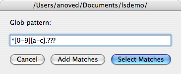

# LSelect

`lselect` is an AppleScript that lets you select files in the Finder using shell glob syntax as you would to list files with [`ls`](http://developer.apple.com/documentation/Darwin/Reference/Manpages/man1/ls.1.html).

When invoked, you will be prompted to enter a glob pattern. The pattern will be matched against filenames in the current directory, and any complete matches will be selected. Spaces and certain other punctuation should be backslash escaped.

The *Select Matches* button sets the Finder selection to any matching files. The *Add Matches* button *adds* any matches to the existing Finder selection.

Originally posted at <http://anoved.net/software/lselect/>.
