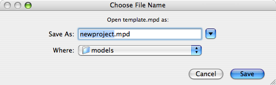

# Open As

Use this Finder script to create and open a named copy of the selected file or folder. When invoked, it will prompt you to input the name and location of the new copy. Clicking "Save" will duplicate the item, assign the duplicate the given name, and open the new file.

Duplication is performed with `cp`, not AppleScript or Finder functions.

Originally posted at <http://anoved.net/2007/08/open-as-pseudo-stationery-finder/>.
