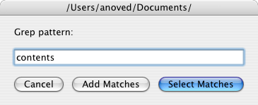

# Select Grep

This script for the Finder is derived from [lselect](../LSelect). Rather than select files whose *names* match the input pattern, however, this script selects files whose *contents* match the input pattern.

Subdirectories are not searched. The pattern is not case sensitive. Extended regular expressions are supported. (The specific options passed to [`grep`](https://developer.apple.com/library/mac/documentation/Darwin/Reference/ManPages/man1/grep.1.html) are `-liE`.)

Originally posted at <http://anoved.net/2007/12/select-grep/>

